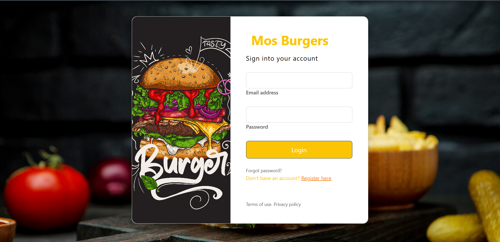
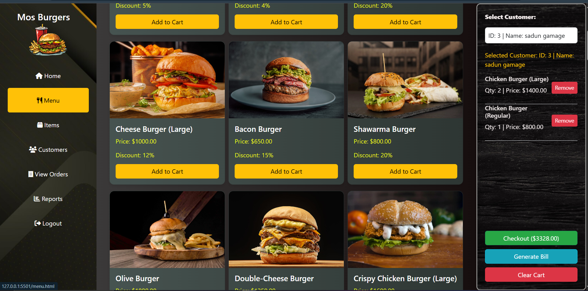
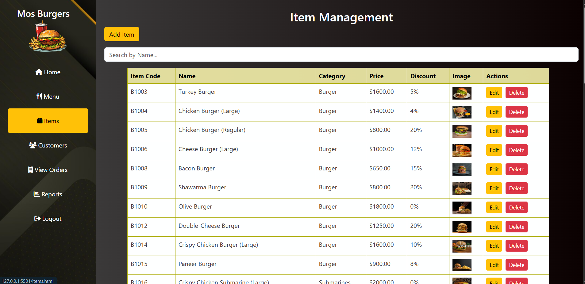
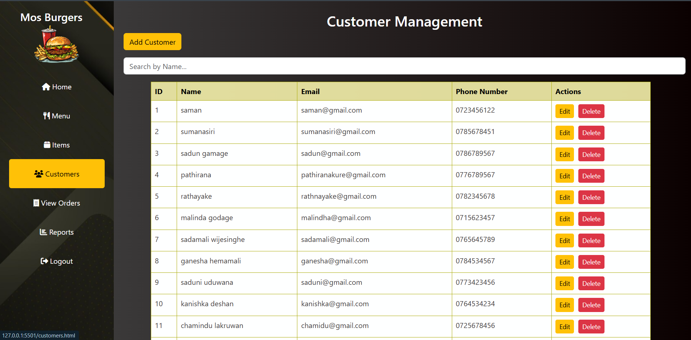

# 🍔 Mos Burger – Full Stack Web Application

## 📌 Overview
**Mos Burger** is a modern, full-stack web application built to streamline online ordering and enhance the customer experience for a burger shop.  
It allows customers to browse the menu, register or log in, and place orders, while administrators can manage products, view and process orders, and handle customer interactions.  
This project reflects real-world challenges in the food and beverage industry and showcases practical full-stack development skills.

---

## 🚀 Key Features

- 🖥️ **User-Friendly Interface**  
  Clean and responsive UI using **HTML**, **CSS**, **Bootstrap**, and **JavaScript**.

- 👥 **Customer Registration & Login**  
  Secure user authentication for customers and admins.

- 🍟 **Online Ordering System**  
  Customers can browse burgers, customize orders, and complete checkouts.

- 💾 **Backend Integration**  
  **Spring Boot** backend connected to a **MySQL** database for data persistence.

- 🔗 **RESTful API Architecture**  
  Efficient, scalable, and well-structured API endpoints for all operations.

---

## 💻 Technologies Used

- **Frontend** → HTML, CSS, JavaScript, Bootstrap  
- **Backend** → Java, Spring Boot, Hibernate, REST APIs  
- **Database** → MySQL  
- **Build Tool** → Maven  
- **Design Patterns** → Applied software design best practices

---

## 🖼️ Screenshots

### 🏠 Login Page

### 🍔 Home Page

### 🛒 Order Page

### 🛒 Item Page

### 🛒 Customer Page

---

